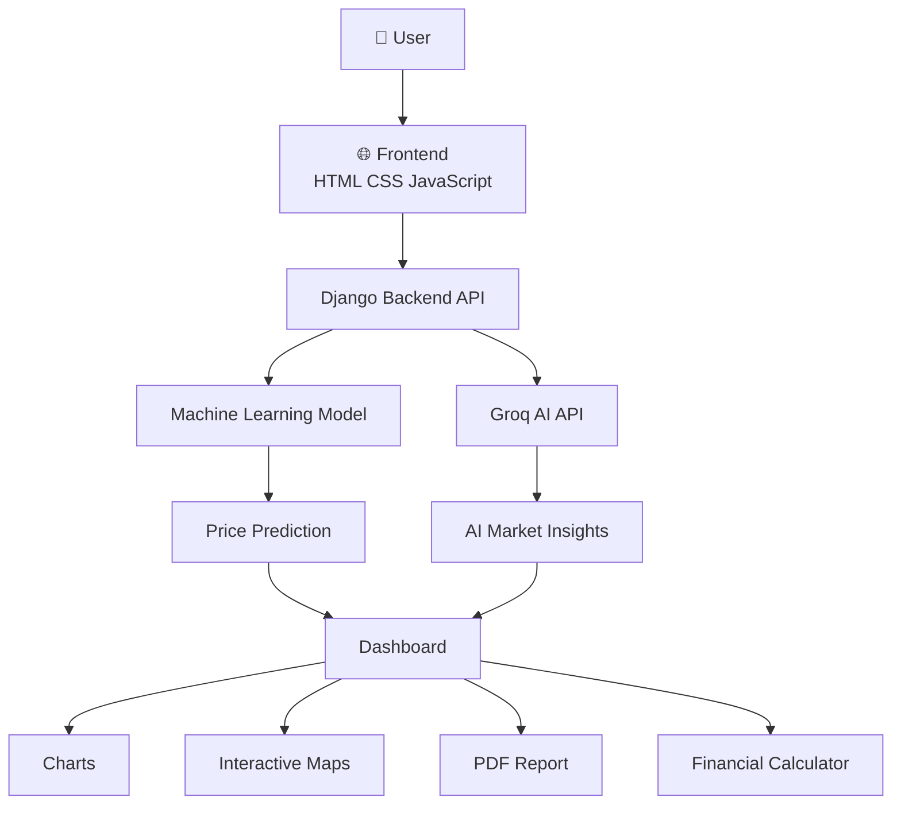
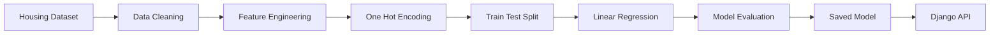
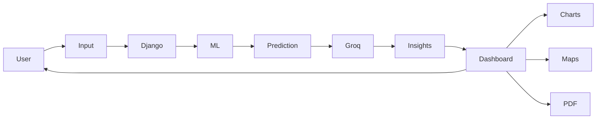

<div align="center">

# 🏡 EstateAI

### 🤖 AI-Powered Bengaluru Real Estate Intelligence

<p align="center">

</p>

[](https://house-price-prediction-l7qm.onrender.com)
[](https://github.com/ajay160380/house-price-prediction)


</div>

---

# 📖 Project Overview

**EstateAI** is an AI-powered Full Stack Real Estate Intelligence Platform that predicts Bengaluru property prices using Machine Learning while leveraging **Groq Llama-3 AI** to provide neighborhood intelligence, investment insights, financial analysis, and interactive visualizations.

The application combines **Machine Learning**, **Artificial Intelligence**, **Interactive Maps**, and **Financial Analytics** into one premium Glassmorphism dashboard.

---

# 🚀 Features

- 🏠 AI House Price Prediction
- 🤖 Groq AI Market Insights
- 📍 Interactive Maps (Leaflet.js)
- 📊 Dynamic Charts
- 💰 EMI Calculator
- 📈 Rental Yield Calculator
- 📄 PDF Report Generator
- 🌙 Glassmorphism Dark UI
- 📱 Fully Responsive
- ⚡ Lightning Fast SPA

---

# 🏗️ Complete System Architecture



---

# 🧠 Machine Learning Pipeline



---

# ⚡ Application Workflow



---

# 📊 Model Performance

| Metric | Value |
|---------|-------|
| Algorithm | Multiple Linear Regression |
| Dataset | 2,000+ Records |
| Features | 243 |
| Locations | 240+ |
| Validation Score | **~85% R²** |
| Prediction | Real-Time |

---

# 🛠️ Tech Stack

| Category | Technology |
|-----------|------------|
| Backend | Python, Django 6 |
| Machine Learning | Scikit-Learn, NumPy, Pandas |
| AI | Groq API (Llama-3.1-8B) |
| Frontend | HTML5, CSS3, JavaScript |
| Charts | Chart.js |
| Maps | Leaflet.js |
| Deployment | Render, Gunicorn, WhiteNoise |

---

# 📂 Project Structure

```text
EstateAI
│
├── predictor/
├── templates/
├── static/
│   ├── css/
│   ├── js/
│   ├── images/
│
├── model/
├── dataset/
├── requirements.txt
├── manage.py
└── README.md
```

---

# 📸 Application Preview

| Home | Prediction |
|------|------------|
|  |  |

| AI Insights | PDF Report |
|--------------|------------|
|  |  |

---

# 🚀 Installation

## Clone Repository

```bash
git clone https://github.com/ajay160380/house-price-prediction.git

cd house-price-prediction
```

## Create Virtual Environment

### macOS / Linux

```bash
python3 -m venv venv

source venv/bin/activate
```

### Windows

```bash
venv\Scripts\activate
```

## Install Dependencies

```bash
pip install -r requirements.txt
```

## Create Environment Variable

Create a **.env** file.

```env
GROQ_API_KEY=your_api_key_here
```

## Run Server

```bash
python manage.py runserver
```

Open

```
http://localhost:8000
```

---

# 🌍 Live Demo

### 🚀 https://house-price-prediction-l7qm.onrender.com

---

# 🛣️ Future Roadmap

- ✅ House Price Prediction
- ✅ Groq AI Integration
- ✅ Interactive Maps
- ✅ PDF Reports
- ✅ Financial Dashboard
- 🔄 Authentication
- 🔄 PostgreSQL
- 🔄 Docker
- 🔄 Recommendation Engine
- 🔄 AI Chat Assistant
- 🔄 Property Image Search

---

# 👨‍💻 Developer

## Ajay Vishwakarma

🎓 **B.Tech CSE (AI)**

🏫 **Babu Banarasi Das University, Lucknow**

### Skills

- Python
- Django
- Machine Learning
- Artificial Intelligence
- SQL
- JavaScript
- REST APIs
- Full Stack Development

This project demonstrates production-ready skills in:

- Full Stack Development
- Machine Learning
- AI Integration
- REST API Development
- Modern UI/UX
- Cloud Deployment

---

<div align="center">

# ⭐ If you like this project, give it a Star ⭐

Made with ❤️ by **Ajay Vishwakarma**

</div>
